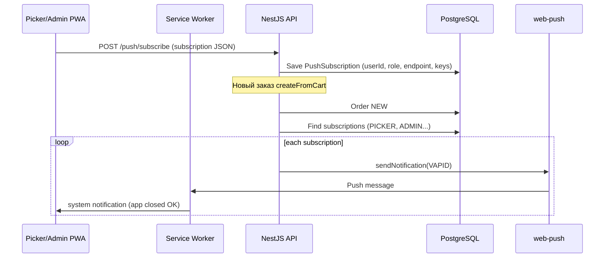

# План: push-уведомления о новых заказах (Picker + Admin)

## Текущее состояние (что есть сейчас)

| Компонент | Статус |
|-----------|--------|
| **PWA** | Есть (`@ducanh2912/next-pwa`): кэш, offline, установка на экран. **Push не настроен.** |
| **Picker** (`/picker`) | Опрос API каждые **12 с** (вкладка открыта), **30 с** (вкладка в фоне). При `status === NEW` — вибрация + короткий звук (`playNewOrderAlert`). **Работает только пока приложение/вкладка жива.** |
| **Courier** (`/courier`) | То же: polling + звук при `READY`. Без push. |
| **Admin** (`/admin/notifications`) | **Заглушка** со статическим списком, не связана с заказами. |
| **Событие заказа** | При создании: `orders.service` вызывает `queueService.enqueue('order.created')` и `events.emit('order.created')`. |
| **Очередь / события** | `QueueService` и `EventEmitterService` — **заглушки** (только `logger.debug`), обработчиков нет. |
| **Web Push в БД** | Нет модели подписок, нет VAPID, нет `web-push` на backend. |

**Вывод:** push-уведомлений при **закрытом PWA** сейчас **нет**. Это ожидаемо: без Service Worker + подписки + серверной отправки браузер не будит приложение.

---

## Цель

- **Picker** и **Admin** (роли `PICKER`, `ADMIN`, `MANAGER` — уточнить список) получают push при **новом заказе** (`NEW` / мгновенный заказ).
- Дополнительно (фаза 2): запланированный заказ перешёл в работу (`order.scheduled.activated`), отмена, «долго в очереди».
- Уведомление открывает `/picker` или `/admin/orders` (deep link).
- Работает при **свёрнутом/закрытом PWA** на Android и desktop Chrome; на **iOS** — только после «Добавить на экран» (iOS 16.4+ Web Push).

---

## Рекомендуемая технология: Web Push (стандарт PWA)

Не FCM как единственный канал (нужно нативное приложение). Для уже установленного PWA оптимально:

1. **Frontend:** `PushManager.subscribe()` + permission.
2. **Service Worker:** обработчик `push` + `notificationclick`.
3. **Backend:** `web-push` (npm) + VAPID keys + таблица подписок.
4. **Триггер:** после `createFromCart` → отправка всем подписчикам с нужной ролью.

Альтернатива на будущее: Telegram-бот для админа (проще, но не «настоящий» push в PWA).

---

## Архитектура



---

## Фаза 1 — MVP (новый заказ → picker + admin)

### 1. Backend: данные и конфиг

- [ ] Prisma модель `PushSubscription`:
  - `id`, `userId`, `role` (snapshot), `endpoint` (unique), `p256dh`, `auth`, `userAgent`, `createdAt`, `lastUsedAt`
  - индекс `(userId)`, unique `(endpoint)`
- [ ] Env: `VAPID_PUBLIC_KEY`, `VAPID_PRIVATE_KEY`, `VAPID_SUBJECT` (`mailto:admin@...`)
  - генерация: `npx web-push generate-vapid-keys`
- [ ] Зависимость: `web-push`

### 2. Backend: API подписок

- [ ] `POST /push/subscribe` — JWT, body: Web Push `PushSubscriptionJSON`
- [ ] `DELETE /push/subscribe` — отписка (logout / выключить в UI)
- [ ] Guard: только staff-роли (`PICKER`, `ADMIN`, `MANAGER`, опционально `STORE_OWNER`)
- [ ] `GET /push/vapid-public-key` — публичный ключ для клиента

### 3. Backend: отправка при заказе

- [ ] `PushNotificationService.sendNewOrder({ orderId, orderNumber, storeId? })`
- [ ] Вызов из `OrdersService.createFromCart` после успешного commit (и из cron активации scheduled — фаза 2)
- [ ] Получатели:
  - все активные подписки с `role IN ('PICKER','ADMIN','MANAGER')`
  - опционально фильтр picker по `storeId` / `businessId` (если picker привязан к магазину — см. `order-scope`)
- [ ] Payload уведомления:
  ```json
  {
    "title": "Yangi buyurtma #12345",
    "body": "3 ta mahsulot · 85 000 so'm",
    "url": "/picker",
    "tag": "order-<id>",
    "orderId": "..."
  }
  ```
- [ ] Обработка `410 Gone` / `404` — удалить мёртвую подписку из БД
- [ ] Заменить заглушку `EventEmitterService` **или** добавить `@OnEvent` listener (лучше отдельный `OrderPushListener`)

### 4. Frontend: Service Worker

- [ ] Кастомный SW (расширить next-pwa): файл `public/sw-push.js` или инжект в workbox
- [ ] `self.addEventListener('push', ...)` → `showNotification`
- [ ] `notificationclick` → `clients.openWindow(url)`
- [ ] Иконки: `icon-192.png`, `badge` из manifest

### 5. Frontend: UI подписки

- [ ] Хук `usePushSubscription()`:
  - проверка `'Notification' in window` && `'serviceWorker' in navigator`
  - запрос permission после жеста пользователя (кнопка, не автоматом)
  - subscribe с `applicationServerKey` из API
- [ ] **Picker:** баннер/переключатель в `/picker` (настройки или header): «Buyurtmalar haqida bildirishnoma»
- [ ] **Admin:** то же в shell или `/admin/notifications` (заменить заглушку)
- [ ] Состояния: unsupported / denied / subscribed / error
- [ ] При logout — `DELETE /push/subscribe`

### 6. Деплой

- [ ] VAPID keys в `.env` на VPS (не в git)
- [ ] HTTPS обязателен (у вас уже есть)
- [ ] После деплоя: picker/admin один раз нажимают «Включить уведомления»

**Оценка MVP:** ~2–4 дня разработки + тест на Android Chrome и desktop.

---

## Фаза 2 — Расширения

- [ ] Push при активации отложенного заказа (`scheduled-orders.cron` → `order.scheduled.activated`)
- [ ] Настройки по типам: только NEW / только scheduled / звук без push
- [ ] Admin: список последних push в `/admin/notifications` (реальные логи из БД `PushDeliveryLog`)
- [ ] Rate limit: не слать 10 push за 1 сек при массовом импорте
- [ ] Реальная очередь (BullMQ / Redis) вместо `QueueService` placeholder — надёжность при пиках

---

## Фаза 3 — Опционально

- [ ] Telegram fallback для admin (webhook + chat_id)
- [ ] Courier push при `READY` (отдельная роль)
- [ ] Business panel: уведомление владельцу магазина

---

## Ограничения и риски

| Платформа | Поведение |
|-----------|-----------|
| **Android Chrome PWA** | Push при закрытом приложении — **да** (после разрешения). |
| **Desktop Chrome/Edge** | **Да**. |
| **iOS Safari PWA** | Push только если добавлено «На экран»; iOS **16.4+**; пользователь должен явно разрешить. |
| **iOS без PWA** | Push **нет** (только polling в открытой вкладке). |
| **Firefox** | Web Push поддерживается. |

- Пользователь может **отклонить** permission — нужен fallback: оставить текущий polling + звук.
- Без подписки push не придёт — важен onboarding («Включить уведомления»).
- Секрет VAPID private key только на сервере.

---

## Что **не** делать в MVP

- Не смешивать с customer push (профиль «Bildirishnomalar» — отдельный продукт, email/SMS позже).
- Не использовать только polling как «решение для закрытого PWA» — батарея и задержка 12–30 с.
- Не полагаться на `QueueService` / `EventEmitter` без реализации.

---

## Чеклист приёмки MVP

1. Admin включает push на `/admin` → подписка в БД.
2. Picker включает push на `/picker` → подписка в БД.
3. Клиент оформляет заказ → в течение нескольких секунд push на **закрытом** PWA picker и admin.
4. Тап по уведомлению → открывается список заказов.
5. Отписка / 410 — подписка удаляется, повторная ошибка не сыпется в лог бесконечно.

---

## Порядок работ (кратко)

1. Prisma + migration + VAPID env  
2. `PushModule` (subscribe API + send service)  
3. Hook в `createFromCart`  
4. SW `push` handler  
5. UI picker + admin  
6. Тест Android + документация для staff («как включить на iPhone»)

---

## Связанные файлы в репозитории

| Область | Файл |
|---------|------|
| Создание заказа | `backend/src/modules/orders/orders.service.ts` |
| Picker polling | `frontend/src/hooks/use-picker-orders.ts` |
| Звук (вкладка открыта) | `frontend/src/lib/picker-order-utils.ts` |
| PWA | `frontend/next.config.ts`, `frontend/src/components/pwa/PWAProvider.tsx` |
| Заглушки | `backend/src/infrastructure/queue/queue.service.ts`, `event-emitter.service.ts` |
| Admin UI (mock) | `frontend/src/app/admin/notifications/page.tsx` |

---

## Статус реализации

**Фаза 1 реализована** (2026-06): `PushModule`, миграция `PushSubscription`, SW `push-sw-handler.js`, UI picker/admin.

На VPS обязательно:
1. `npx web-push generate-vapid-keys` → `VAPID_PUBLIC_KEY` / `VAPID_PRIVATE_KEY` в **корневом** `.env` (для Docker Compose) и в `backend/.env.production`
2. В `docker-compose.yml` переменные `VAPID_*` должны быть в секции `backend.environment` (уже добавлены)
3. После изменения: `docker compose up -d --build backend`
4. `npx prisma migrate deploy`
3. Пересборка backend + frontend
4. Picker/Admin: Profil yoki Notifications → **Yoqish**

---

*Документ создан для планирования. Фаза 2+ — по необходимости.*
